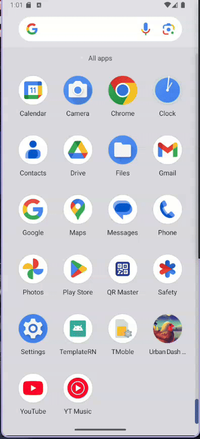
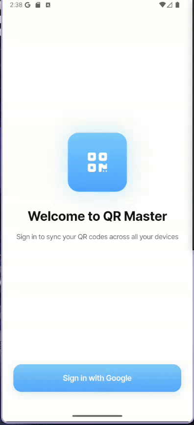
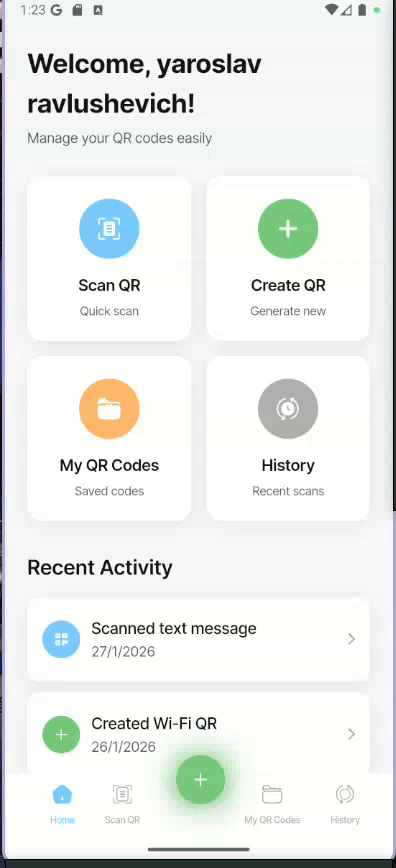
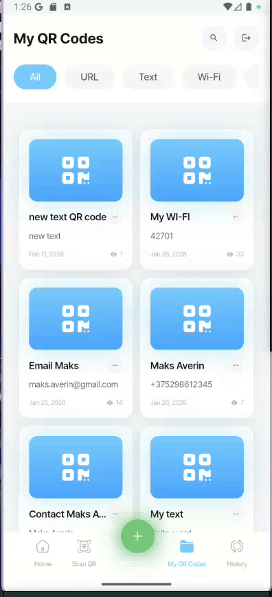
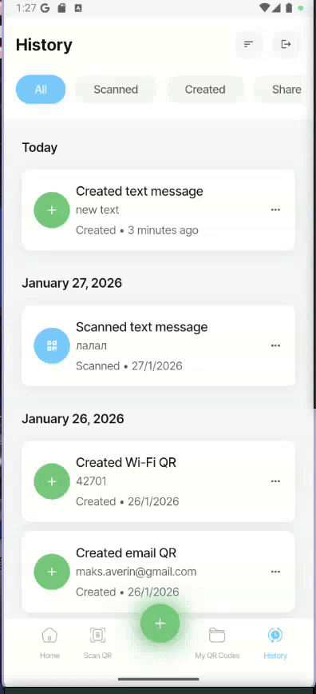
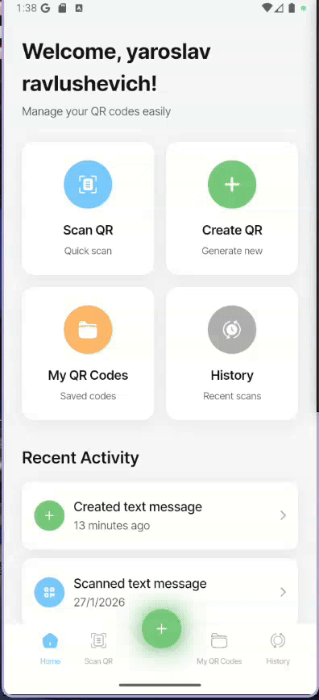

# QR Master

Приложение для создания и автоматического распознавания QR-кодов.

## Описание проекта

QR Master — это мобильное приложение на Flutter, объединяющее в себе мощный генератор и адаптивный сканер QR-кодов. Приложение позволяет пользователям не только мгновенно считывать информацию, но и создавать персонализированные коды для любых нужд: от ссылок и контактных данных до настроек Wi-Fi и текстовых заметок.

## Демонстрация

|                  App-icon and Splash-Screen                   |                  Onboarding Screen                   |                  Auth Screen                   |
| :-----------------------------------------------------------: | :--------------------------------------------------: | :--------------------------------------------: |
|  |  |  |

|                            Home screen                             |                  Scan QR Screen                   |                      Create QR Code                      |
| :----------------------------------------------------------------: | :-----------------------------------------------: | :------------------------------------------------------: |
|  |  |  |

|                      My QR Codes                      |                  History Screen                   |                  Logout                   |
| :---------------------------------------------------: | :-----------------------------------------------: | :---------------------------------------: |
|  |  |  |

---

# QR Master (English)

An application for creating and automatically recognizing QR codes.

## Project Description

QR Master is a Flutter mobile app that combines a powerful QR code generator and a responsive scanner. The app allows users to not only instantly scan information but also create personalized codes for any need: from links and contact information to Wi-Fi settings and text notes.

## Demo

|                  App-icon and Splash-Screen                   |                  Onboarding Screen                   |                  Auth Screen                   |
| :-----------------------------------------------------------: | :--------------------------------------------------: | :--------------------------------------------: |
|  |  |  |

|                            Home screen                             |                  Scan QR Screen                   |                      Create QR Code                      |
| :----------------------------------------------------------------: | :-----------------------------------------------: | :------------------------------------------------------: |
|  |  |  |

|                      My QR Codes                      |                  History Screen                   |                  Logout                   |
| :---------------------------------------------------: | :-----------------------------------------------: | :---------------------------------------: |
|  |  |  |
